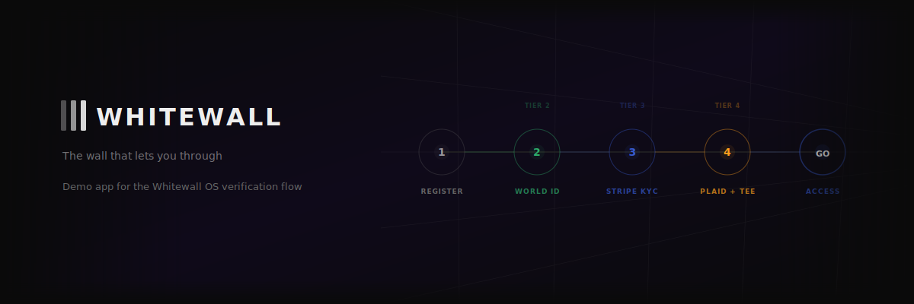
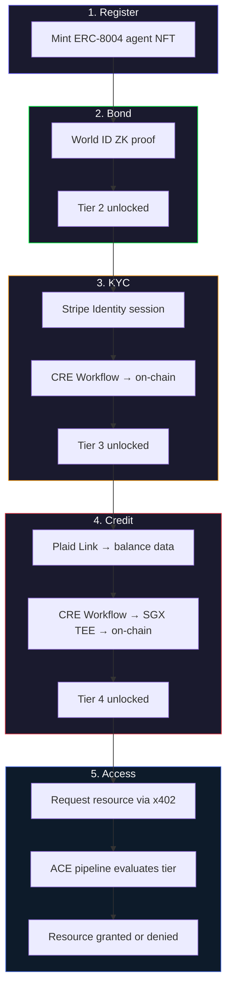

<div align="center">




# whitewall

**The wall that lets you through.**

[](https://nextjs.org)
[](https://www.typescriptlang.org/)
[](https://www.npmjs.com/package/@whitewall-os/sdk)

> Part of [**Whitewall OS**](https://github.com/hihi-yessir/Verified-Agent-Hub) — on-chain identity and access control for AI agents.

</div>

---

Demo app for the Whitewall OS verification flow. Walk through agent registration, World ID bonding, Stripe KYC, Plaid credit scoring, and tier-gated resource access — all wired to live contracts on Base Sepolia.

---

## User Flow



---

## Pages

| Route | What it does |
|:------|:-------------|
| `/` | Landing — architecture visualization |
| `/tryout` | Full verification flow (register → bond → KYC → credit) |
| `/demo` | Architecture demo view |
| `/feed` | Live contract state viewer |

---

## SDK Usage

The app uses [`@whitewall-os/sdk`](https://www.npmjs.com/package/@whitewall-os/sdk) to read on-chain state:

```typescript
import { WhitewallOS } from "@whitewall-os/sdk";

const wos = new WhitewallOS({ publicClient, chain: "baseSepolia" });

// Check agent verification status
const status = await wos.getFullStatus(agentId);
// → { isRegistered, isHumanVerified, isKYCVerified, creditScore, tier }
```

---

## Setup

```bash
# Install
npm install

# Dev server
npm run dev

# Open http://localhost:3000
```

### Environment Variables

Create `.env.local`:
```bash
NEXT_PUBLIC_WALLETCONNECT_PROJECT_ID=...
NEXT_PUBLIC_WORLD_APP_ID=...
NEXT_PUBLIC_WORLD_ACTION=...
```

---

## Project Structure

```
whitewall/
├── src/
│   ├── app/
│   │   ├── page.tsx           # Landing
│   │   ├── tryout/            # Verification flow
│   │   ├── demo/              # Architecture viz
│   │   ├── feed/              # Live state viewer
│   │   └── api/               # API routes
│   ├── components/            # React components
│   └── lib/                   # SDK integration, utils
├── public/                    # Static assets
├── docs/                      # Additional docs
└── test-agent/                # Test agent scripts
```

---

## Related Repos

| Repository | Role |
|:-----------|:-----|
| [**Verified-Agent-Hub**](https://github.com/hihi-yessir/Verified-Agent-Hub) | Smart contracts, ACE policies, validators, SDK |
| [**whitewall-cre**](https://github.com/hihi-yessir/whitewall-cre) | CRE workflows (access, KYC, credit) |
| [**x402-auth-gateway**](https://github.com/hihi-yessir/x402-auth-gateway) | Payment-gated proxy |
