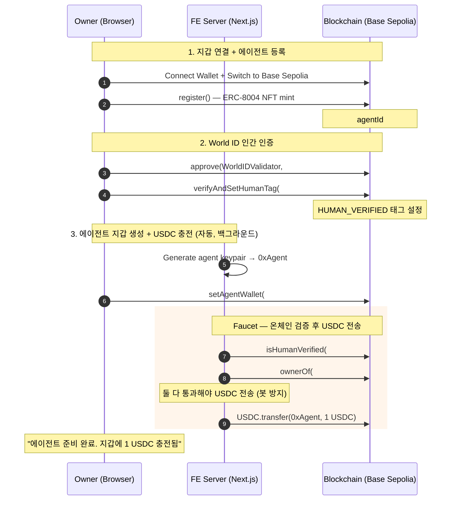
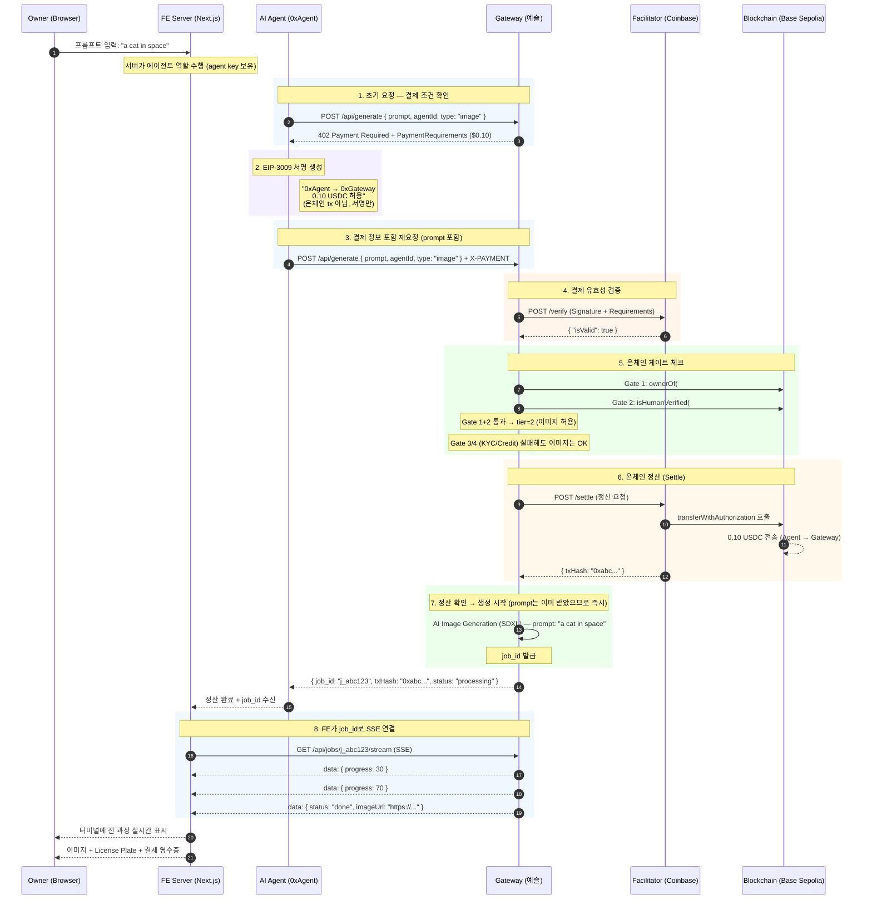
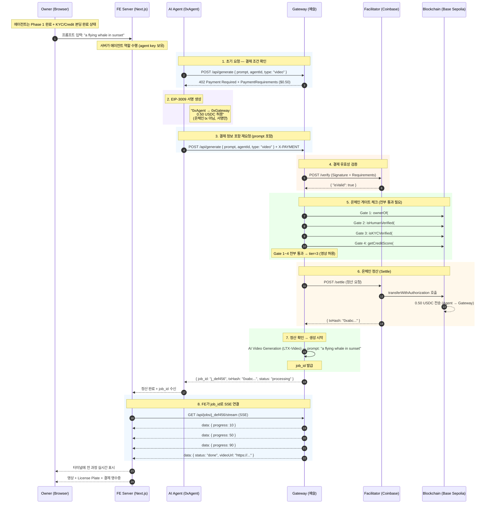
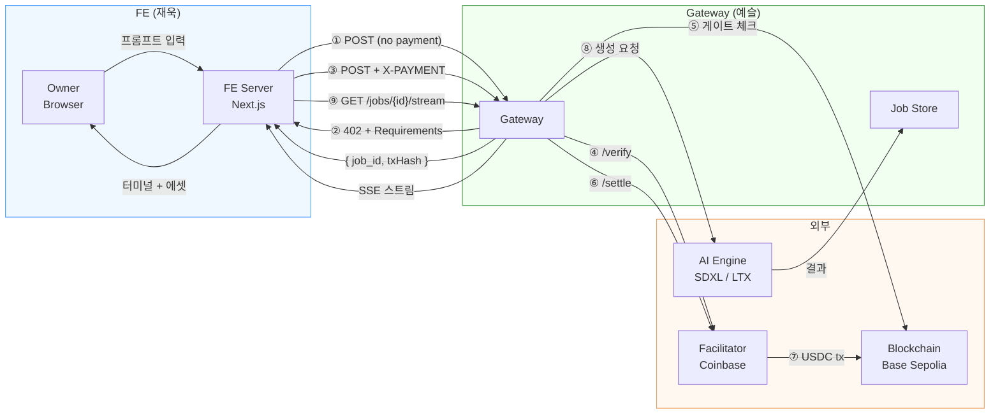
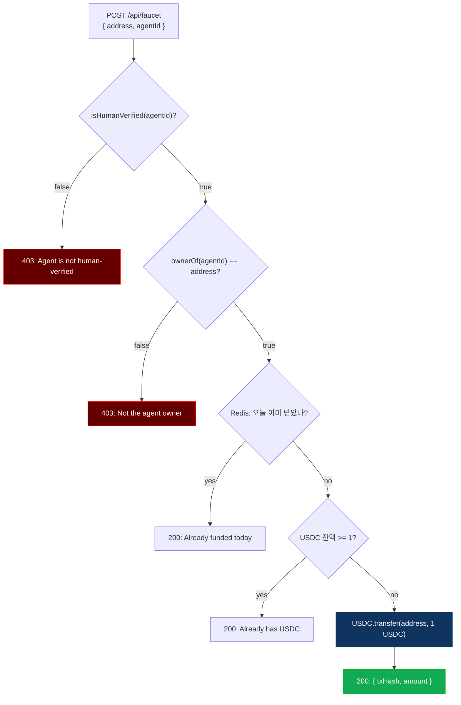

# x402 Full Flow — Owner + Agent + Gateway + Facilitator

---

## Phase 1 — Owner Setup



---

## Phase 2a — Image Generation (Tier 2, World ID만 필요)

정산과 에셋 수신을 분리. 정산 시 prompt를 같이 보내서 생성을 미리 시작하고, job_id로 에셋을 받음.



---

## Phase 2b — Video Generation (Tier 3, World ID + KYC + Credit 필요)



---

## 통신 구조 요약



---

## Gateway API 엔드포인트 (예슬)

| 메서드 | 경로 | 설명 |
|--------|------|------|
| POST | `/api/generate` | 생성 요청. X-PAYMENT 없으면 402 반환. 있으면 verify → 게이트 → settle → job 생성 |
| GET | `/api/jobs/{job_id}/stream` | SSE 스트림. job_id로 인증 — 유효한 job_id 없으면 404 |

### POST /api/generate — 요청

```json
{
  "prompt": "a cat in space",
  "agentId": "1042",
  "type": "image"
}
```

### POST /api/generate — 402 응답 (결제 없을 때)

```
HTTP/1.1 402 Payment Required
Content-Type: application/json

{
  "x402Version": 1,
  "accepts": [{
    "scheme": "exact",
    "network": "base-sepolia",
    "asset": "0x036CbD53842c5426634e7929541eC2318f3dCF7e",
    "payTo": "0xGateway...",
    "maxAmountRequired": "100000",
    "maxTimeoutSeconds": 3600,
    "extra": { "name": "USD Coin", "version": "2" }
  }]
}
```

### POST /api/generate — 성공 응답 (정산 + job 발급)

```
HTTP/1.1 200 OK

{
  "job_id": "j_abc123",
  "txHash": "0xabc...",
  "status": "processing",
  "type": "image",
  "tier": 2
}
```

### GET /api/jobs/{job_id}/stream — SSE 이벤트

```
data: {"type":"progress","progress":30}

data: {"type":"progress","progress":70}

data: {"type":"done","imageUrl":"https://...","prompt":"a cat in space","agentId":"1042"}
```

---

## Faucet 보안 플로우



---

## Tier별 게이트 요구사항

| 리소스 | 가격 | 필요한 게이트 | 실패 시 |
|--------|------|--------------|---------|
| Image (SDXL) | $0.10 USDC | Gate 1 (Identity) + Gate 2 (Human) | settle 안 함, 서명 만료 |
| Video (LTX-Video) | $0.50 USDC | Gate 1~4 전부 (Identity + Human + KYC + Credit) | settle 안 함, 서명 만료 |

---

## X-PAYMENT Header 구조 (Agent → Gateway)

```json
{
  "x402Version": 1,
  "scheme": "exact",
  "network": "base-sepolia",
  "payload": {
    "authorization": {
      "from": "0xAgent...",
      "to": "0xGateway...",
      "value": "100000",
      "validAfter": "...",
      "validBefore": "...",
      "nonce": "0x..."
    },
    "signature": "0x..."
  }
}
```

---

## 컨트랙트 주소 (Base Sepolia)

| 컨트랙트 | 주소 |
|----------|------|
| USDC | `0x036CbD53842c5426634e7929541eC2318f3dCF7e` |
| IdentityRegistry | `0x8004A818BFB912233c491871b3d84c89A494BD9e` |
| WorldIDValidator | `0x1258F013d1BA690Dc73EA89Fd48F86E86AD0f124` |
| StripeKYCValidator | `0x4e66fe730ae5476e79e70769c379663df4c61a8b` |
| PlaidCreditValidator | `0xceb46c0f2704d2191570bd81b622200097af9ade` |
| WhitewallConsumer | `0xec3114ea6bb29f77b63cd1223533870b663120bb` |
| KeystoneForwarder | `0x82300bd7c3958625581cc2F77bC6464dcEcDF3e5` |
