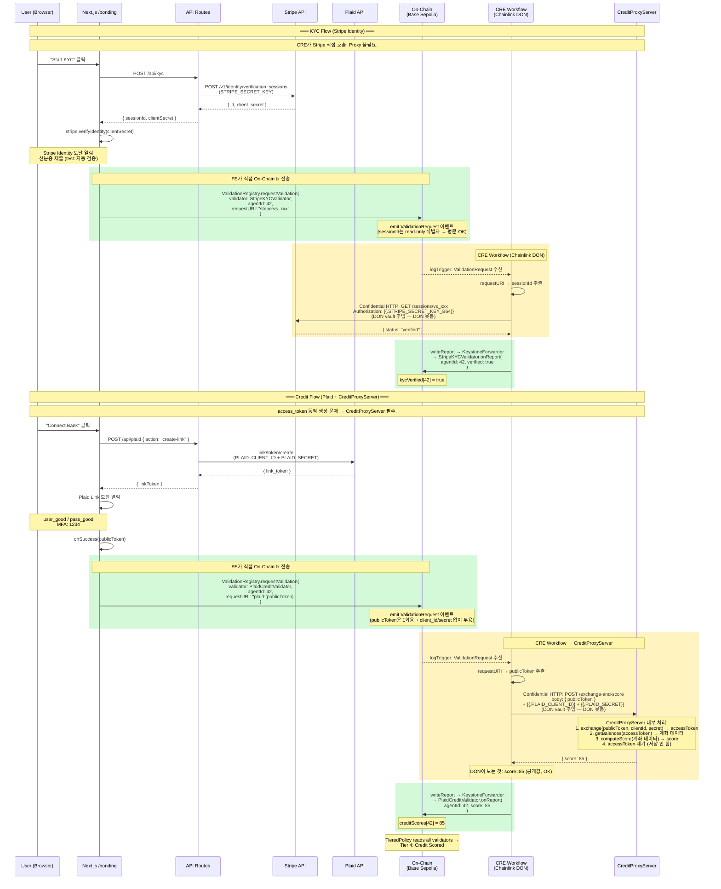
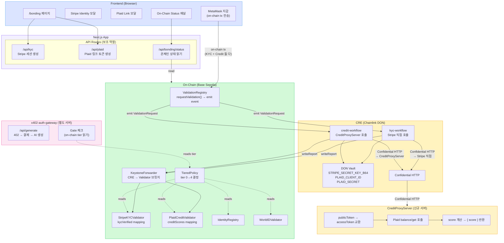
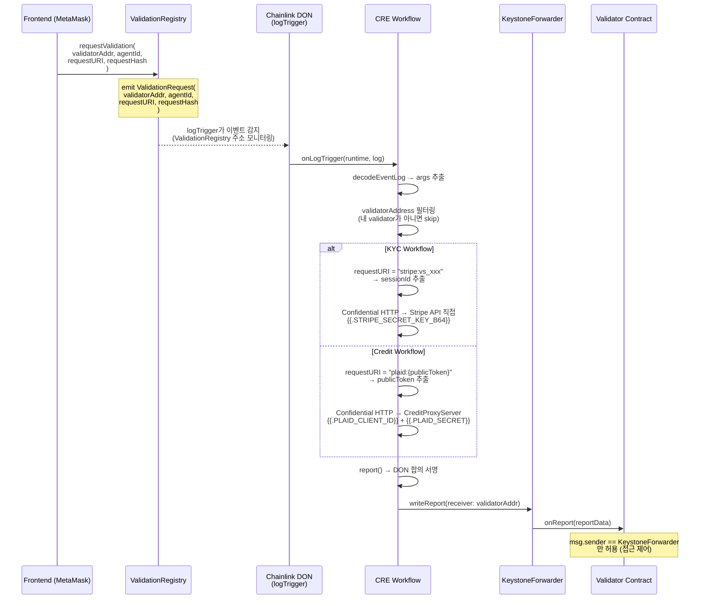
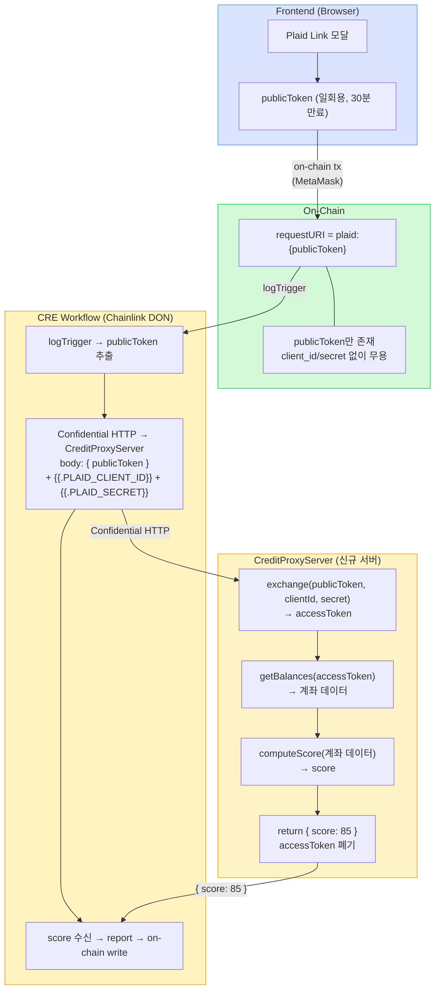
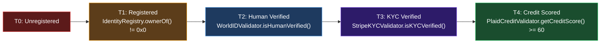
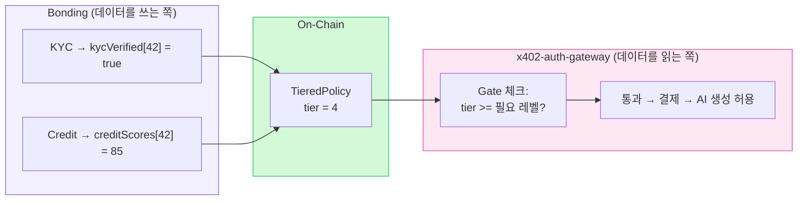

# Bonding Architecture: Stripe KYC + Plaid Credit → On-Chain

## Overview

Bonding은 에이전트의 신원(KYC)과 신용(Credit Score)을 검증하여 온체인에 기록하는 프로세스다.

핵심 원칙:
- **민감한 데이터(API 키, access_token, 계좌 데이터)는 절대 on-chain에 가지 않는다**
- 체인에는 `verified=true` 또는 `score=85` 같은 **검증 결과만** 기록
- Plaid `access_token`은 CreditProxyServer 내부에서만 생성/사용/폐기 — 어디에도 저장 안 됨
- **Chainlink Confidential HTTP 사용은 필수 요구사항이다**

### Confidential HTTP 필수 요구사항

모든 외부 API 호출은 CRE 워크플로우의 Confidential HTTP를 통해 이루어져야 한다.

| 요구사항 | 설명 |
|---------|------|
| **API 키 보호** | `STRIPE_SECRET_KEY`, Plaid `client_id`/`secret` 모두 DON vault의 `{{.TEMPLATE}}` 치환으로만 전달. 개별 DON 노드가 볼 수 없다. |
| **CRE 경유** | 외부 API 호출이 CRE를 거치지 않는 직접 호출은 허용하지 않는다. 데모/sandbox 제외. |

이 요구사항은 Chainlink CRE의 Confidential Compute 로드맵과 alignment를 유지하고,
향후 TEE-isolated execution, ZKP, DECO 등 확장 시 아키텍처 변경을 최소화하기 위함이다.

---

## Components

| Component | 뭐임 | 역할 | 위치 |
|-----------|------|------|------|
| **Frontend** (`/bonding`) | Next.js 페이지 | Stripe/Plaid 모달 UI, on-chain tx 전송, 상태 표시 | 브라우저 |
| **API Routes** (`/api/kyc`, `/api/plaid`) | 같은 Next.js 앱의 서버사이드 | Stripe 세션 생성, Plaid link token 생성 (보조 역할만) | Vercel |
| **CreditProxyServer** | **신규 배포 서버** | CRE에서 Confidential HTTP로 호출됨. publicToken + client_id + secret 받아서 access_token 교환 → Plaid 계좌 조회 → score 계산 → score만 반환 | 별도 서버 |
| **On-Chain Contracts** | Base Sepolia 스마트 컨트랙트 | ValidationRegistry, Validators, TieredPolicy | Base Sepolia |
| **CRE** (Chainlink DON) | Chainlink 워크플로우 | on-chain 이벤트 수신 → Confidential HTTP → 검증 결과 → onReport() | Chainlink DON |
| **x402-auth-gateway** | **별도 서버** | 결제 검증 + gate 체크 + AI 생성. bonding과 직접 관련 없음 — bonding 결과(tier)를 **읽기만** 함 | 별도 Vercel |

> **KYC는 CreditProxyServer를 사용하지 않는다.** CRE가 Stripe API를 vault secret으로 직접 호출 가능.
> CreditProxyServer는 **Credit flow 전용** — access_token 동적 생성 문제를 해결하기 위함.

---

## Token Flow: 누가 뭘 보는가

| Token | FE (브라우저) | API Routes (서버) | On-Chain | CRE (DON) | CreditProxyServer |
|-------|-------------|------------------|----------|-----------|-------------------|
| Stripe `clientSecret` | O (모달용) | O (생성) | X | X | X |
| Stripe `sessionId` | O (표시) | O (생성) | **O** (requestURI 평문) | O (Stripe 호출) | X |
| `STRIPE_SECRET_KEY` | **X** | O (세션 생성용) | X | **O** (DON vault) | X |
| Plaid `linkToken` | O (모달용) | O (생성) | X | X | X |
| Plaid `publicToken` | O (1회용) | X | **O** (requestURI 평문) | O (이벤트에서 읽음) | O (교환용) |
| Plaid `access_token` | **X** | **X** | **X** | **X** | **O** (내부 생성/사용/폐기) |
| Plaid `client_id` + `secret` | **X** | O (link token용) | X | vault `{{.TEMPLATE}}` | O (CRE에서 전달받음) |
| 계좌 데이터 | **X** | **X** | **X** | **X** | **O** (score 계산용) |
| `verified=true` | O (표시) | X | **O** | O (생산) | X |
| `score=85` | O (표시) | X | **O** | O (응답 수신) | O (계산/반환) |

**핵심**: `access_token`과 계좌 데이터는 CreditProxyServer 내부에서만 존재. DON 노드 포함 어디에도 노출 안 됨.

---

## Full Flow: KYC + Credit (Sequence Diagram)



---

## Component Architecture



---

## CRE Trigger 메커니즘: On-Chain Event → Workflow



> **Redis 큐 없음**. CRE는 on-chain `ValidationRequest` 이벤트를 `logTrigger`로 직접 감지.

---

## KYC vs Credit: 왜 처리 방식이 다른가

| | KYC (Stripe) | Credit (Plaid) |
|---|---|---|
| per-user 토큰 | `sessionId` (read-only 식별자) | `publicToken` → `access_token` (계좌 접근 권한) |
| 토큰 민감도 | 낮음 — 상태 조회만 가능 | 높음 — 계좌 데이터 접근 |
| CRE가 외부 API 직접 호출 가능? | **가능** — sessionId + vault secret이면 충분 | **불가능** — access_token이 동적, vault에 못 넣음 |
| Proxy 서버 필요? | **아니오** | **예 — CreditProxyServer** |
| on-chain requestURI | `"stripe:vs_xxx"` | `"plaid:{publicToken}"` |
| DON vault secrets | `STRIPE_SECRET_KEY_B64` | `PLAID_CLIENT_ID` + `PLAID_SECRET` |
| on-chain tx 전송 주체 | **FE (MetaMask)** | **FE (MetaMask)** |

---

## Credit Flow: CreditProxyServer 설계

### 문제

Plaid Link는 유저마다 다른 `access_token`을 발급한다.
DON vault는 정적 flat key-value 저장소로 per-user 동적 시크릿을 지원하지 않는다.

### 해결: CreditProxyServer — DB 없이, 한 워크플로우 안에서

`publicToken`을 on-chain requestURI에 포함하고, CRE가 이를 읽어 `client_id`/`secret`(vault)과 함께 CreditProxyServer에 전달.
CreditProxyServer는 한 request 안에서 exchange → 조회 → 계산 → 반환하고 access_token을 폐기한다.



### publicToken on-chain이 안전한 이유

| 우려 | 답변 |
|------|------|
| publicToken이 on-chain에 보이잖아? | 보임. 근데 `client_id` + `secret` 없이 exchange 불가 — Plaid가 거부함 |
| 누가 front-running 해서 먼저 exchange? | `client_id` + `secret`이 없으므로 불가능 |
| exchange 후에는? | publicToken은 1회용 — 교환 후 자동 무효화, 30분 후 만료 |

### DB가 필요 없는 이유

`publicToken` → `access_token` → 계좌조회 → score 계산이 **한 HTTP request 안에서** 끝남.
access_token을 저장할 이유가 없고, CreditProxyServer는 **완전히 stateless**.

### DON이 보는 것 / 못 보는 것

| 데이터 | DON이 보는가? | 이유 |
|--------|-------------|------|
| publicToken | **봄** | on-chain event에서 읽음. OK — 혼자선 쓸모없음 |
| client_id, secret | **못봄** | `{{.TEMPLATE}}` vault 치환 |
| access_token | **못봄** | CreditProxyServer 내부에서만 생성/사용/폐기 |
| 계좌 데이터 | **못봄** | CreditProxyServer 내부 |
| score | **봄** | 응답값. OK — 어차피 on-chain에 쓸 공개값 |

### encryptOutput: false

CreditProxyServer가 score만 반환하므로 `encryptOutput: true` 불필요.
DON이 score를 봐도 됨 — on-chain 공개값이니까.

---

## Confidential HTTP: 역할과 한계

### 할 수 있는 것

| 기능 | 메커니즘 | 예시 |
|------|---------|------|
| **정적 API 키 보호** | `{{.TEMPLATE}}` vault 치환 | `{{.STRIPE_SECRET_KEY_B64}}` — DON 노드 못 봄 |
| **서비스 인증 보호** | `{{.TEMPLATE}}` vault 치환 | `{{.PLAID_CLIENT_ID}}` — DON 못 봄 |
| **응답 암호화 (필요 시)** | `encryptOutput: true` | AES-GCM, 워크플로우는 encrypted bytes만 수신 |

### 할 수 없는 것

| 한계 | 이유 |
|------|------|
| **런타임 동적 값 보호** | `{{.TEMPLATE}}`는 vault에 미리 등록된 정적 값만 지원 |
| **워크플로우 코드 내 연산 은닉** | JS 코드 실행 결과는 DON 노드가 볼 수 있음 |
| **데이터 진위 증명** | HTTP 응답이 진짜 해당 API에서 온 것인지 증명 불가 (DECO/TLS Notary 필요) |

### encryptOutput: true 가 빛나는 경우

`encryptOutput: true`는 **DON이 응답값을 몰라야 할 때** 사용:

- CRE가 외부 API를 직접 호출하고, 응답에 민감한 데이터가 포함된 경우
- 워크플로우는 encrypted bytes를 그대로 on-chain에 전달
- 외부 서버가 vault secret으로 복호화 → 처리

우리 Credit flow에서는 CreditProxyServer가 score만 반환하므로 불필요.

### 우리 아키텍처에서의 적용

```
KYC:    CRE →(Confidential HTTP)→ Stripe API 직접
        {{.STRIPE_SECRET_KEY_B64}} 보호 ✓
        sessionId는 민감하지 않아 JS 변수 OK ✓
        Proxy 불필요 ✓

Credit: CRE →(Confidential HTTP)→ CreditProxyServer
        {{.PLAID_CLIENT_ID}} + {{.PLAID_SECRET}} 보호 ✓
        publicToken은 on-chain 공개값, JS 변수 OK ✓
        access_token, 계좌 데이터는 CreditProxyServer 내부에서만 ✓
```

### 향후 확장 (ZKP + DECO 추가 시)

현재 CreditProxyServer를 신뢰하는 구조. 완전한 trustless를 위해:

1. **ZKP**: CreditProxyServer가 score 계산 + ZK proof 생성 → CRE는 proof만 검증 → 조작 방지
2. **DECO/TLS Notary**: Plaid 응답의 진위를 암호학적으로 증명 → CreditProxyServer의 데이터 조작 방지

---

## TieredPolicy: 온체인 검증 계층



---

## 보안 모델

### On-Chain에 도달하는 것 vs 안 가는 것

| On-Chain에 기록 (안전) | 절대 On-Chain에 안 감 |
|----------------------|---------------------|
| `verified = true` | `STRIPE_SECRET_KEY` |
| `score = 85` | `PLAID_SECRET` |
| `sessionId` (read-only 식별자) | `access_token` |
| `publicToken` (1회용, 단독 무용) | 계좌 데이터 (잔액, 계좌번호) |
| `requestHash`, `dataHash` | |

### DON 가시성

CreditProxyServer 설계로 DON 가시성이 최소화됨:

| 데이터 | DON이 보는가? |
|--------|-------------|
| sessionId | 봄 (OK — read-only) |
| Stripe verified 결과 | 봄 (OK — on-chain 공개값) |
| publicToken | 봄 (OK — 단독 무용) |
| score | 봄 (OK — on-chain 공개값) |
| access_token | **못봄** |
| 계좌 데이터 | **못봄** |
| Stripe/Plaid API keys | **못봄** (vault) |

**DON이 보는 민감 데이터: 없음.** 공개 정보만.

---

## x402-auth-gateway와의 관계

bonding과 x402-auth-gateway는 **직접 관련 없음**. 연결 포인트는 하나:



---

## Chainlink Confidential Compute 로드맵

Chainlink은 CRE를 [Confidential Compute](https://blog.chain.link/chainlink-confidential-compute/) 방향으로 확장하고 있다.

| Phase | 설명 | 우리에게 바뀌는 것 |
|-------|------|-----------------|
| **현재** | CRE + Confidential HTTP + CreditProxyServer | DON은 공개 정보만 봄 |
| **Phase 2** (TEE 격리) | 워크플로우가 TEE 안에서 실행 | 추가 보안 (이미 민감 데이터 없지만) |
| **Phase 3** (내부 연산) | CRE 내부에서 exchange + 조회 + 계산 가능 | CreditProxyServer 제거, 전부 CRE 내부로 |

Phase 3이 되면 CreditProxyServer의 역할을 CRE가 완전히 흡수한다.

---

## Contract Addresses (Base Sepolia)

| Contract | Address |
|----------|---------|
| TieredPolicy | `0x63b4d2e051180c3c0313eb71a9bdda8554432e23` |
| IdentityRegistry | `0x8004A818BFB912233c491871b3d84c89A494BD9e` |
| WorldIDValidator | `0x1258F013d1BA690Dc73EA89Fd48F86E86AD0f124` |
| StripeKYCValidator | `0x12b456dcc0e669eeb1d96806c8ef87b713d39cc8` |
| PlaidCreditValidator | `0x9a0ed706f1714961bf607404521a58decddc2636` |
| ValidationRegistry | TieredPolicy에서 읽음 |
| KeystoneForwarder | `0x82300bd7c3958625581cc2f77bc6464dcecdf3e5` |

---

## DON Vault Secrets

| Key | 용도 | 누가 사용 |
|-----|------|----------|
| `STRIPE_SECRET_KEY_B64` | Stripe API 인증 (Base64) | kyc-workflow |
| `PLAID_CLIENT_ID` | Plaid API 인증 | credit-workflow |
| `PLAID_SECRET` | Plaid API 인증 | credit-workflow |

> DON vault는 **정적 flat key-value** 저장소.
> 워크플로우 배포 시점에 `cre` CLI로 업로드하며, 런타임에 동적 추가 불가.

---

## /bonding UX Demo

현재 구현된 UX 데모는 sandbox 모드에서 실제 Stripe/Plaid API를 호출한다:

1. **KYC 카드**: Stripe Identity 모달 → 검증 → FE에서 직접 on-chain tx
2. **Credit 카드**: Plaid Link 모달 → publicToken → FE에서 직접 on-chain tx
3. **On-Chain Status**: 실시간으로 validator 상태를 읽어 tier 표시

### Test Credentials

| Service | Credentials |
|---------|------------|
| Stripe Identity | Test mode: 자동 검증 (테스트 문서 사용) |
| Plaid Link | `user_good` / `pass_good`, MFA: `1234` |

---

## 미해결 과제

### 아키텍처

- [ ] CreditProxyServer 서버 구현 및 배포 (production용 — sandbox에선 CRE가 static access_token으로 Plaid 직접 호출)
- [ ] credit-workflow 리팩토링 — Plaid 직접 호출 → CreditProxyServer 호출로 변경 (production)
- [ ] CRE bodyString에서 JS 변수 + `{{.TEMPLATE}}` 혼합 사용 가능 여부 최종 확인
- [ ] Chainlink Confidential Compute Phase 2 EA 접근 확인

### 데모 코드

- [x] `/api/bonding/validate` 제거 — FE가 MetaMask로 직접 on-chain tx
- [x] `/api/bonding/status` — Redis 읽기 제거, on-chain 상태만
- [x] FE 컴포넌트 — MetaMask tx 전송 로직 추가, 용어 수정

### 배포 현황 (2026-03-02 확인)

- [x] CRE kyc-workflow 배포 완료 — logTrigger on ValidationRegistry
- [x] CRE credit-workflow 배포 완료 — logTrigger on ValidationRegistry (sandbox: static PLAID_ACCESS_TOKEN)
- [x] CRE access-workflow 배포 완료 — HTTP trigger from x402-auth-gateway
- [x] x402-auth-gateway 배포 완료 — https://x402-auth-gateway.onrender.com
- [x] WhitewallConsumer (`0xb5845901c590f06ffa480c31b96aca7eff4dfb3e`) — AccessGranted/AccessDenied 이벤트

### Resource별 Required Tier (access-workflow)

| Resource | Required Tier | 필요한 검증 |
|----------|--------------|------------|
| `"image"` | Tier 2 | Register + WorldID |
| `"video"` | Tier 3 | + Stripe KYC |
| `"premium"` | Tier 4 | + Plaid Credit (score >= 50) |

### Credit Workflow Sandbox 구현 참고

현재 배포된 credit-workflow는 sandbox shortcut:
- `PLAID_ACCESS_TOKEN`을 DON vault에 static하게 저장
- requestURI `"plaid:{publicToken}"` 에서 prefix만 체크, publicToken 값은 미사용
- Production에서는 CreditProxyServer 경유로 변경 필요 (per-user dynamic access_token)
