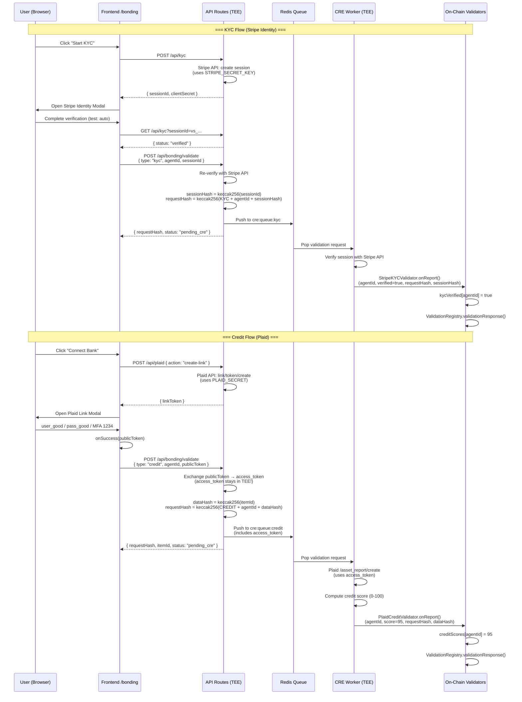
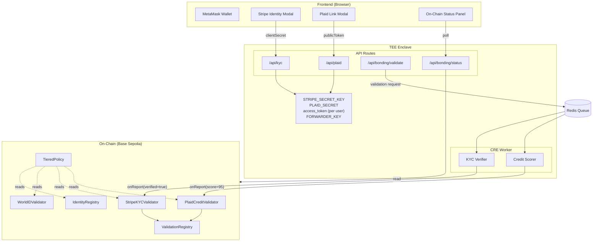
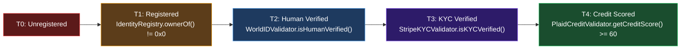
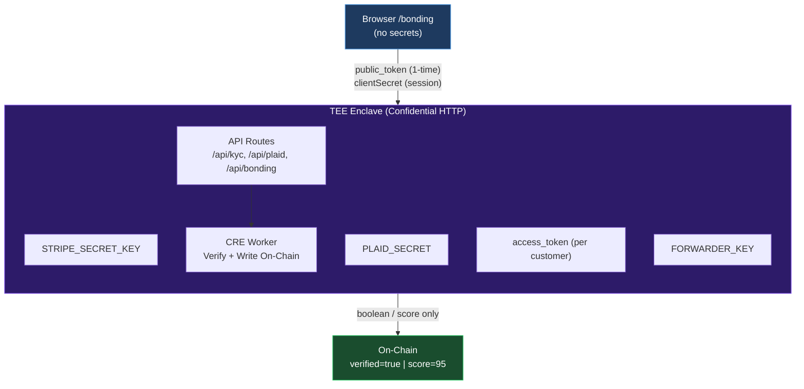

# Bonding Architecture: Stripe KYC + Plaid Credit → On-Chain

## Overview

Bonding은 에이전트의 신원(KYC)과 신용(Credit Score)을 검증하여 온체인에 기록하는 프로세스입니다.
핵심 원칙: **민감한 데이터(API 키, access_token)는 TEE 안에서만 존재**하고, 체인에는 `verified=true` 또는 `score=95` 같은 결과만 기록됩니다.

---

## Components

| Component | 역할 | 위치 |
|-----------|------|------|
| **Frontend** (`/bonding`) | Stripe/Plaid 모달 UI, 지갑 연결 | 브라우저 |
| **API Routes** (`/api/kyc`, `/api/plaid`, `/api/bonding/*`) | 토큰 교환, 검증 요청 생성 | Vercel (demo) / TEE (prod) |
| **Redis Queue** (`cre:queue:kyc`, `cre:queue:credit`) | CRE가 처리할 검증 요청 대기열 | Upstash Redis |
| **CRE (Confidential Runtime)** | 검증 수행 + 온체인 기록 | TEE Enclave |
| **On-Chain Validators** | `StripeKYCValidator`, `PlaidCreditValidator` | Base Sepolia |
| **TieredPolicy** | 모든 validator를 읽어 tier 0-4 결정 | Base Sepolia |

---

## Token Flow: 누가 뭘 보는가

| Token | Frontend | Server (TEE) | On-Chain |
|-------|----------|-------------|----------|
| Stripe `clientSecret` | O (브라우저 모달용) | O (생성) | X |
| Stripe `sessionId` | O (표시용) | O (검증용) | X |
| `STRIPE_SECRET_KEY` | **X (절대 안감)** | O (Stripe API 호출) | X |
| `verified=true` | O (결과 표시) | O (판단) | **O** `kycVerified[agentId]` |
| Plaid `public_token` | O (일회용) | O (교환용, 1회) | X |
| Plaid `access_token` | **X (절대 안감)** | O (TEE 안에서만) | X |
| `PLAID_SECRET` | **X (절대 안감)** | O (Plaid API 호출) | X |
| `score=95` | O (결과 표시) | O (판단) | **O** `creditScores[agentId]` |

**Confidential HTTP**: API 키와 access_token은 TEE enclave 안에 머문다.
체인에 도달하는 것은 오직 검증 결과(boolean/score)뿐이다.

---

## Full Flow: KYC + Credit (Sequence Diagram)

---

## Component Architecture

---

## TieredPolicy: 온체인 검증 계층

각 tier에서 접근 가능한 리소스가 달라집니다. Tier가 높을수록 더 비싼/민감한 리소스를 사용할 수 있습니다.

---

## Security Model

브라우저에는 민감한 키가 절대 존재하지 않습니다.
`public_token`은 일회용이며, 교환 후 무효화됩니다.
체인에는 `verified=true` 또는 `score=95`만 기록됩니다.

---

## Contract Addresses (Base Sepolia)

| Contract | Address |
|----------|---------|
| TieredPolicy | `0x63b4d2e051180c3c0313eb71a9bdda8554432e23` |
| IdentityRegistry | `0x8004A818BFB912233c491871b3d84c89A494BD9e` |
| WorldIDValidator | `0x1258F013d1BA690Dc73EA89Fd48F86E86AD0f124` |
| StripeKYCValidator | `0x12b456dcc0e669eeb1d96806c8ef87b713d39cc8` |
| PlaidCreditValidator | `0x9a0ed706f1714961bf607404521a58decddc2636` |
| WhitewallConsumer | `0xb5845901c590f06ffa480c31b96aca7eff4dfb3e` |

---

## /bonding UX Demo

현재 구현된 UX 데모는 sandbox 모드에서 실제 Stripe/Plaid API를 호출합니다:

1. **지갑 연결**: MetaMask → Base Sepolia
2. **Agent ID 입력**: IdentityRegistry에서 등록된 에이전트 ID
3. **KYC 카드**: Stripe Identity 모달 → 검증 → validation request 생성 → Redis 큐
4. **Credit 카드**: Plaid Link 모달 → 은행 연결 → token 교환 → validation request 생성 → Redis 큐
5. **On-Chain Status**: 실시간으로 validator 상태를 읽어 tier 표시

### Test Credentials

| Service | Credentials |
|---------|------------|
| Stripe Identity | Test mode: 자동 검증 (테스트 문서 사용) |
| Plaid Link | `user_good` / `pass_good`, MFA: `1234` |
